## Lab 1:  Deploy and Build Applications

Duration: 40 minutes

In this lab, you will learn how to build and deploy both frontend as well as backend Spring applications to Azure Spring Apps. In order to develop a high level grasp of how to deploy and operate the same, you will first attempt to setup a very basic hello-world spring boot app. After that, we will configure Spring Cloud Gateway, deploy the frontend and backend apps of acme-fitness (the demo application you will use in this lab), and verify that we can access the frontend as well as backend. Additionally, we will change the Spring Cloud Gateway rules for these backend apps and set them up to communicate with the Application Configuration Service and the Service Registry.

### Exercise 1: Deploy a Hello World service to ASA-E 

In this task, you will try to deploy a very simple hello-world spring boot app to get a high level understanding of how to deploy an asa-e app and access it.

1. If you are not logged in already, click on the Azure portal shortcut that is available on the desktop and log in with the below Azure credentials.
    
    * Azure Username/Email: <inject key="AzureAdUserEmail"></inject> 
    * Azure Password: <inject key="AzureAdUserPassword"></inject>
    
1. Now open gitbash from the start menu, click on the windows button and open **Git Bash**   

     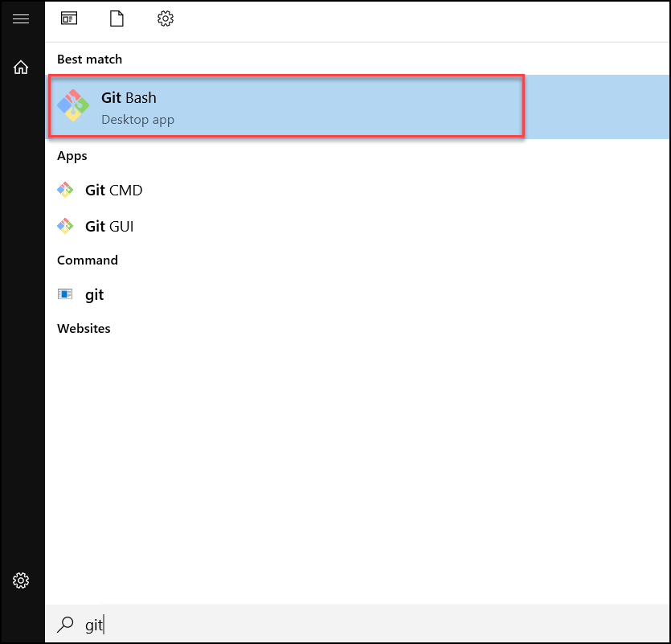                          

1. Once the Git Bash is open, please continue with the next step.

1. Run the following command to remove previous versions and install the latest Azure Spring Apps Enterprise tier extension:

    ```shell
    az extension remove --name spring-cloud
    az extension add --name spring
    ```
    
1. To change the directory to the sample app repository to your shell, run the following command in the bash shell pane: 

    ```shell
      cd source-code/acme-fitness-store
    ```
    
1. Create a bash script with environment variables by making a copy of the supplied template:

    ```shell
    cp ./azure/setup-env-variables-template.sh ./azure/setup-env-variables.sh
    ```

1. To open the `./scripts/./azure/setup-env-variables.sh` file, run the following command:

   ```shell
   cd azure
   code setup-env-variables.sh
   ```

1. Update the following variables in the setup-env-variables.sh file by replacing the following values and **Save** and **Close** the file :

   ```shell
    export SUBSCRIPTION=subscription-id                 # replace it with your subscription-id
    export RESOURCE_GROUP=Modernize-java-apps-SUFFIX           # Replace suffix with deploymentID from environment details page
    export SPRING_APPS_SERVICE=azure-spring-apps-SUFFIX   # Replace suffix with deploymentID from environment details page
    export LOG_ANALYTICS_WORKSPACE=acme-log-analytic  
    export REGION=eastus                           # choose a region with Enterprise tier support
   ```
   >**Note:** You can copy the above values from the environment details page.
   
    

1. Run the following command to move back to the acme-fitness-store directory and then set up the environment:
  
   ```shell
   cd ..
   source ./azure/setup-env-variables.sh
   ```   
  
1. Run the following command to log in to Azure:

    ```shell
   az login
   ```   
   
   > **Note:** Once you run the command, you will be redirected to the default browser, and then enter the following:
   > - **Azure username:** <inject key="AzureAdUserEmail"></inject>  
   > - **Password:** <inject key="AzureAdUserPassword"></inject> 
   > 
   > Close the tab when you see the successful login message and proceed with the next command.


1. Run the following commands to get the list of subscriptions and also to set your subscription:

   ```shell
   az account list -o table
   az account set --subscription ${SUBSCRIPTION}
   ```     
      
   > **Note:** Replace ${SUBSCRIPTION} with the subscription Id which you can find on the Environment details page. 

    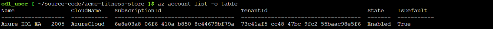
   
1. Now, run the following command to set your default resource group name and cluster name:

   ```shell
    az configure --defaults \
    group=${RESOURCE_GROUP} \
    location=${REGION} \
    spring=${SPRING_APPS_SERVICE}
   ```
    
1. To deploy the hello world app and creating the Spring Boot application, run the following command and change the directory to hello world :

   ```shell
    cd hello-world/complete
   ```

1. Run the following command to create the 'hello-world' app instance and deploy it to Azure Spring Apps Enterprise:

   ```shell
   az spring app create -n hello-world --assign-endpoint true
   mvn clean package -DskipTests
   az spring app deploy -n hello-world --artifact-path target/spring-boot-complete-0.0.1-SNAPSHOT.jar
   cd ..
   cd ..
   ```
   > **Note:** Creating and deploying the hello-world app will take around 2-3 minutes.

1. Now navigate back to the Azure portal in the browser and look for your Azure Spring Apps instance in your resource group.

1. Click on **Apps** in the **Settings** section of the navigation pane and select **hello-world**.

    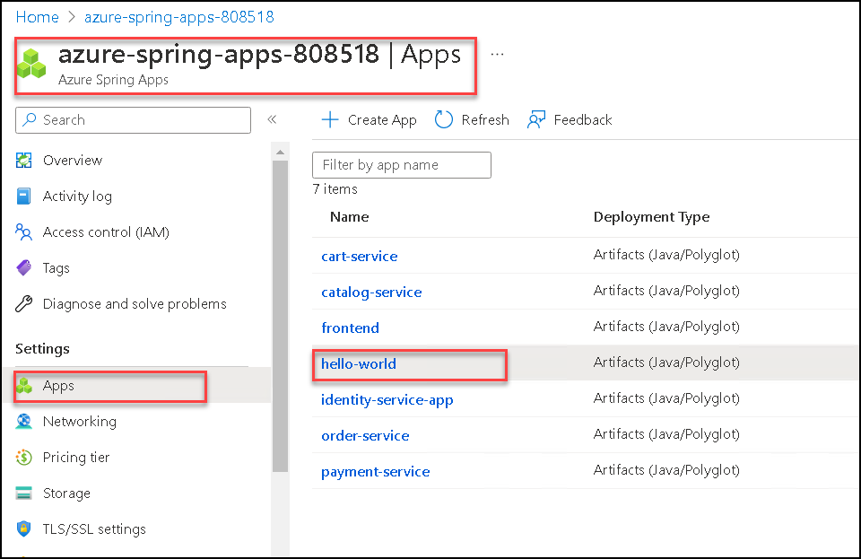

1. On the overview page, find the **Test endpoint** in the **Essentials** section, click on the **link** to browse the application.

    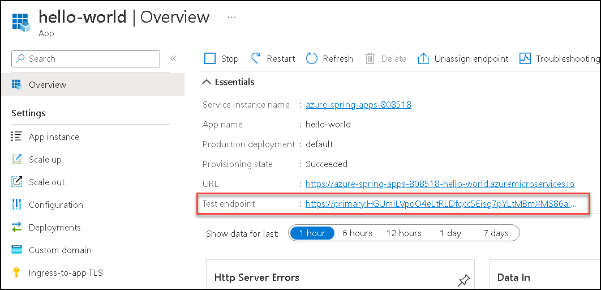
    
1. A new browser tab will open, and you should be able to see your **hello world** app successfully deployed. 
   
    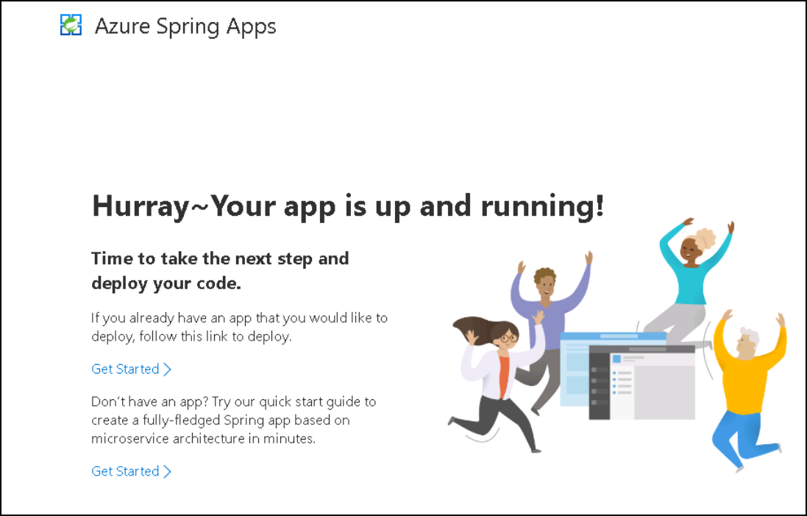    
    
  

### Exercise 2: Deploy Frontend app

 In this section we are going to deploy the frontend of acme-fitness (the demo application that you will be using in this lab), configure that with Spring Cloud Gateway (SCG) and validate that we are able to access the frontend. You will create a spring cloud gateway instance for acme-fitness and connect all the frontend/backend services to this gateway instance. This way the gateway instance acts as the proxy for any requests that are targeted towards the acme-fitness application. Routing rules bind endpoints in the request to the backend applications. In the task below we will also create a rule in SCG to the frontend app.

This diagram below shows the final result once this section is complete:

   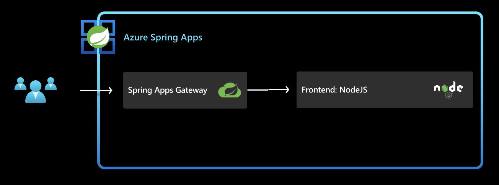
    
> **Please note that we have already deployed the Azure Spring app and created the required frontend app to save the time during the lab.**
 
1. To assign a public endpoint and update the Spring Cloud Gateway configuration with API information, run the following command:

   ```shell
     az spring gateway update --assign-endpoint true
     export GATEWAY_URL=$(az spring gateway show | jq -r '.properties.url')
    
     az spring gateway update \
      --api-description "Acme Fitness Store API" \
      --api-title "Acme Fitness Store" \
      --api-version "v1.0" \
      --server-url "https://${GATEWAY_URL}" \
      --allowed-origins "*" \
      --no-wait
   ```

    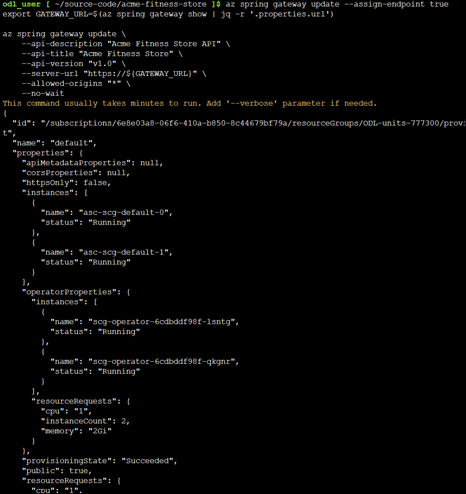
    
   > **Note:** Please be aware that the below commands can run for up to two minutes. Hold off until the commands has completed.

1. Run the following command to create routing rules for the frontend application:
   
   ```shell
      az spring gateway route-config create \
      --name ${FRONTEND_APP} \
      --app-name ${FRONTEND_APP} \
      --routes-file ./routes/frontend.json
   ```

1. Run the following command to deploy and build each application with its required parameters:
   
   ```shell
       az spring app deploy --name ${FRONTEND_APP} \
       --source-path ./apps/acme-shopping 
   ```
    
   > **Note:** Deploying the application will take approximately 2-3 minutes.

1. Run the following command and then open the output from the following command in a browser:

   ```shell
    echo "https://${GATEWAY_URL}"
   ```
   
  
   > **Note:** If you see acme-fitness home page displayed as below, then it means that your frontend app and its corresponding route in SCG are configured correctly and deployed successfully. Explore the application, but notice that not everything is functioning yet. Continue on to next section to configure the rest of the functionality.
    
   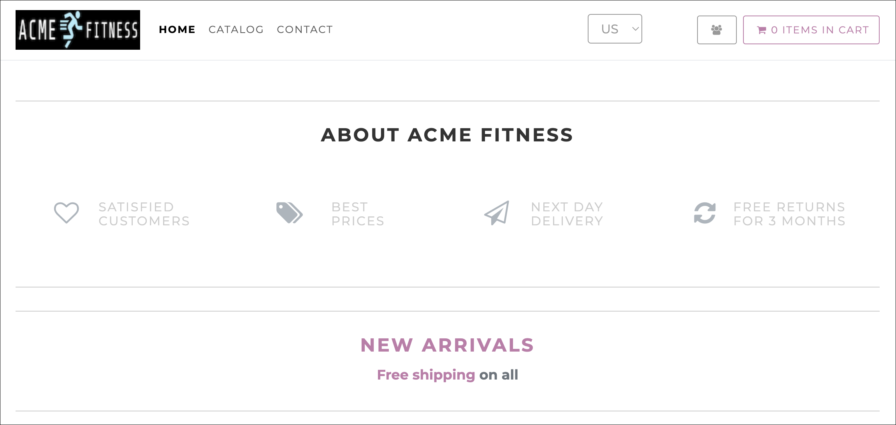
   
   


### Exercise 3: Deploy Backend applications

In this section we are going to deploy the backend apps for acme-fitness application. We will also updates the rules for these backend apps in Spring Cloud Gateway and configure these apps to talk to Application Configuration Service and Service Registry. The Application configuration service is a feature of azure spring apps enterprise that makes Spring Apps config server capabilities available in a polyglot way. ASA-E internally uses Tanzu Service Registry for dynamic service discovery.

This diagram below shows the final result once this section is complete:

   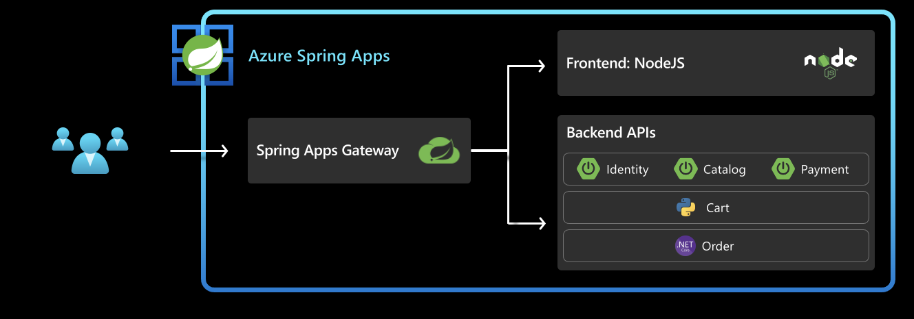

> **Please note that we have already deployed the Azure Spring app and created the required backend apps to save the time during the lab.**

1. Run the following command to bind the spring applications to the Application Configuration Service:

   ```shell
    az spring application-configuration-service bind --app ${PAYMENT_SERVICE_APP}
    az spring application-configuration-service bind --app ${CATALOG_SERVICE_APP}
   ```
    
   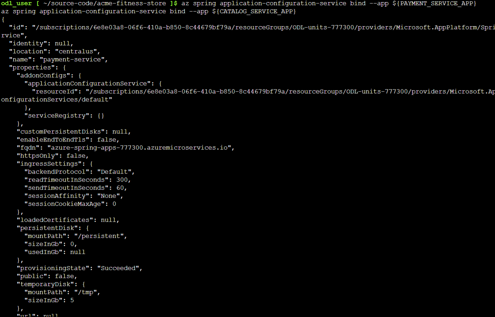
   
   > **Note:** Please be aware that the above commands can run up to two minutes. 

1. Run the following command to bind the spring applications to the Service Registry:

   ```shell
     az spring service-registry bind --app ${PAYMENT_SERVICE_APP}
     az spring service-registry bind --app ${CATALOG_SERVICE_APP}
   ```

   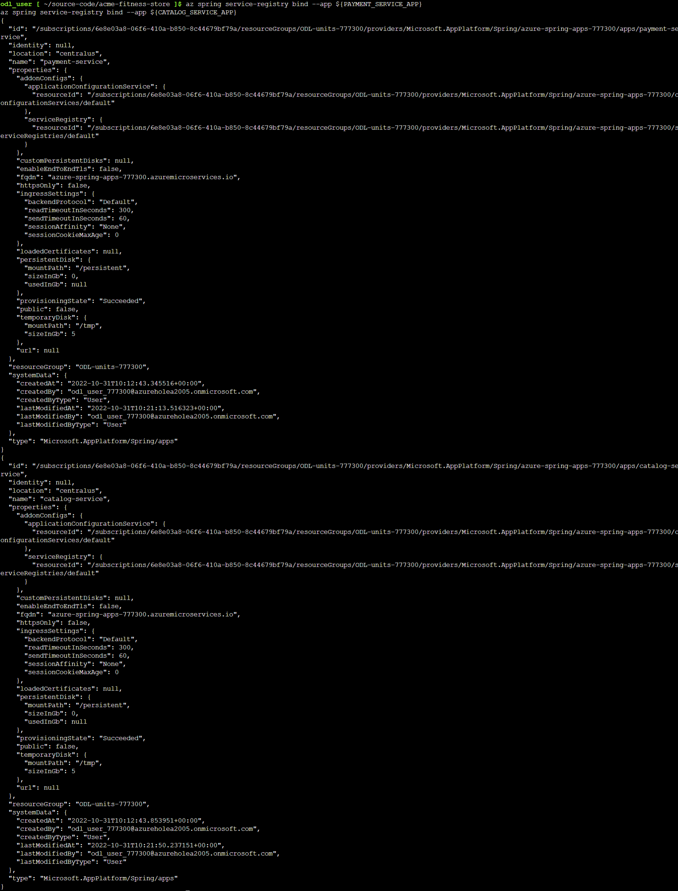

   > **Note:** Please be aware that the above commands can take up to two minutes to complete the running.

1. Run the following command to create routing rules for all backend applications:

    ```shell
    az spring gateway route-config create \
      --name ${CART_SERVICE_APP} \
      --app-name ${CART_SERVICE_APP} \
      --routes-file ./routes/cart-service.json
    
    az spring gateway route-config create \
      --name ${ORDER_SERVICE_APP} \
      --app-name ${ORDER_SERVICE_APP} \
      --routes-file ./routes/order-service.json

   az spring gateway route-config create \
      --name ${CATALOG_SERVICE_APP} \
      --app-name ${CATALOG_SERVICE_APP} \
      --routes-file ./routes/catalog-service.json
   ```
   
   > **Note:** Routing rules bind endpoints in the request to the backend applications. For example in the Cart route below, the routing rule indicates any requests to /cart/** endpoint gets routed to backend Cart App.

   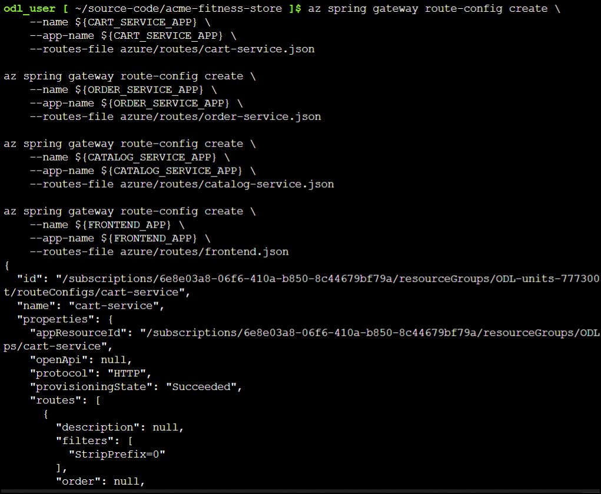
   
   > **Note:** Please be aware that the above commands can run up to two minutes. 

1. Run the following command to deploy and build each backend application with its required parameters:

    ```shell
    # Deploy Payment Service
    az spring app deploy --name ${PAYMENT_SERVICE_APP} \
       --config-file-pattern payment/default \
       --source-path ./apps/acme-payment 

    # Deploy Catalog Service
    az spring app deploy --name ${CATALOG_SERVICE_APP} \
       --config-file-pattern catalog/default \
       --source-path ./apps/acme-catalog 

    # Deploy Order Service
    az spring app deploy --name ${ORDER_SERVICE_APP} \
       --source-path ./apps/acme-order 

    # Deploy Cart Service 
    az spring app deploy --name ${CART_SERVICE_APP} \
       --env "CART_PORT=8080" \
       --source-path ./apps/acme-cart 
    ```

   > **Note:** Deploying all applications will take approximately 10-15 minutes.

   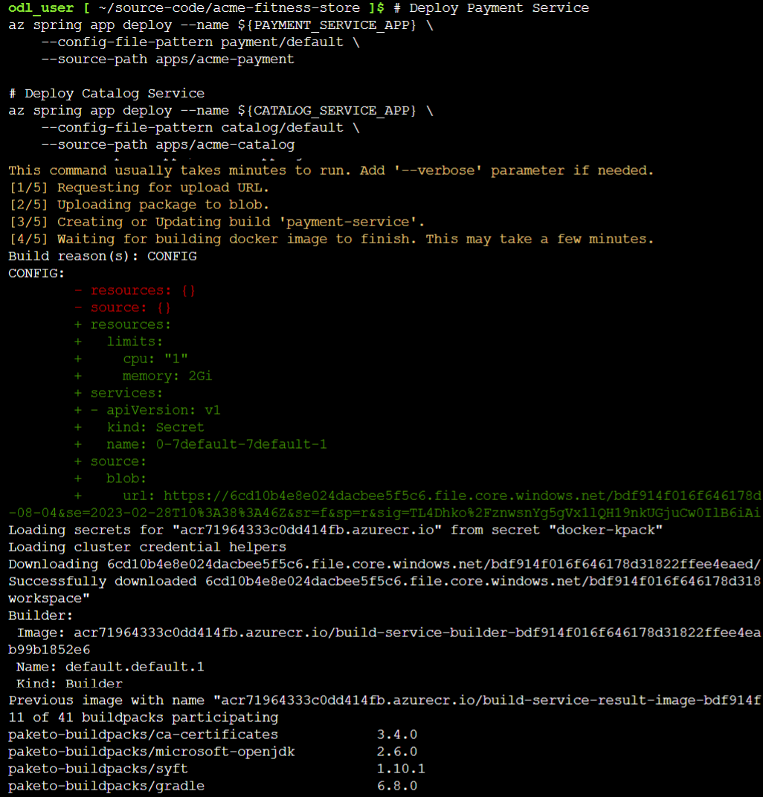

1. Run the following command and then open the output from the following command in a browser:

   ```shell
   echo "https://${GATEWAY_URL}"
   ```
   

1. Copy the gateway URL and paste it into a new browser and then you should see the ACME Fitness Store Application. Now that all the required apps are deployed, you should be able to open the home page and access through the entire app. Explore the application but notice that not everything is functioning yet. Continue to Lab 2 to configure Single Sign On to enable the rest of the functionality (features like logging in, adding items to the cart, or completing an order).

   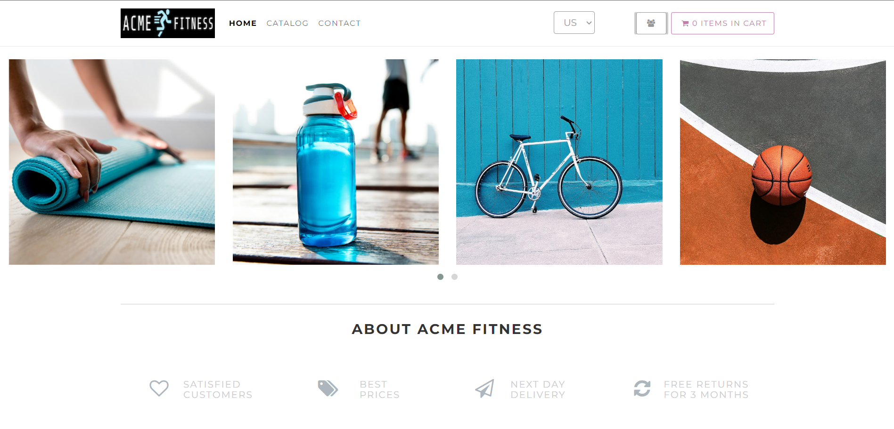

1. To assign an endpoint to API Portal, move back to git bash and run the following command:

   ```shell 
   az spring api-portal update --assign-endpoint true
   export PORTAL_URL=$(az spring api-portal show | jq -r '.properties.url')
   ```

1. Run the following command and then open the output from the following command in a browser:

   ```shell
   echo "https://${PORTAL_URL}"
   ```
   
   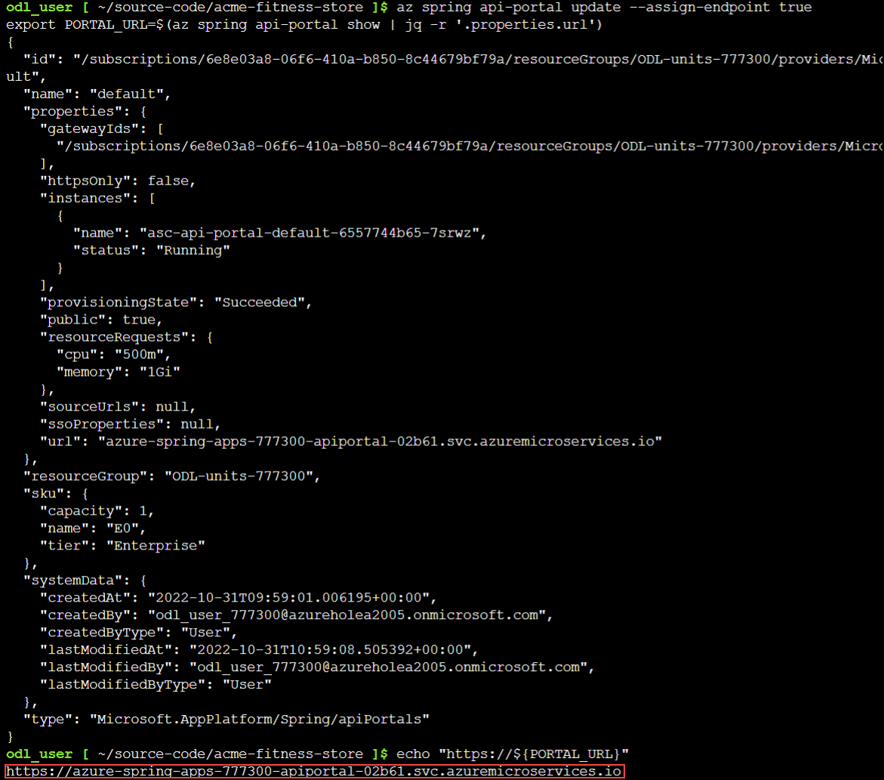
   
1. Copy the URL and paste it in a new browser and then you should see the API portal of the ACME Fitness Store Application.

    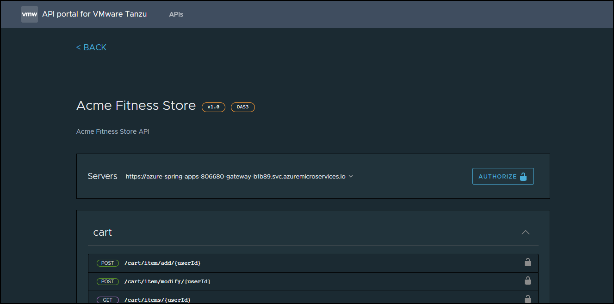
    
    
 > **Note:** After finishing the exercise, be sure not to close the Git Bash window.


Now, click on **Next** in the lab guide section in the bottom right corner to jump to the next exercise instructions.
