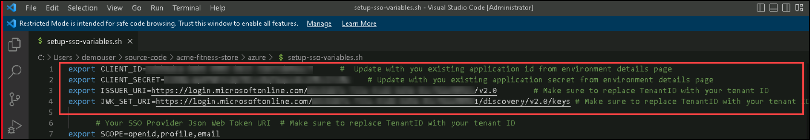
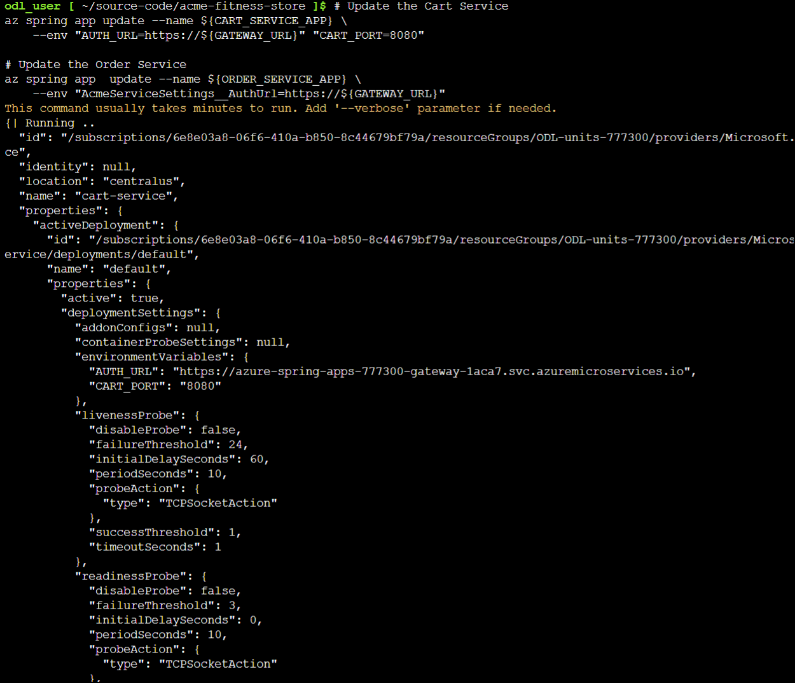
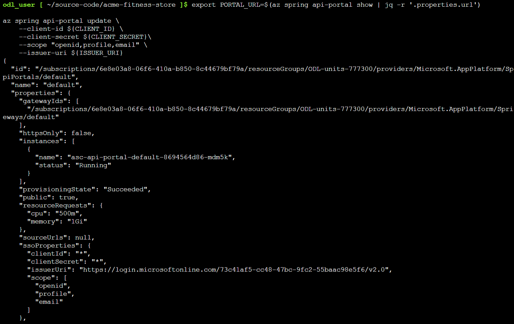

## Lab 2: Configure Single Sign-On

Duration: 20 minutes
 
In this lab, you will configure Single Sign-On for Spring Cloud Gateway using Azure Active Directory.

### Task 1: Prepare your environment for SSO Deployments

1. To use an existing SSO Identity Provider, copy the existing template:

   ```shell
   cp ./azure/setup-sso-variables-template.sh ./azure/setup-sso-variables.sh
   ```

1. To open the `./scripts/setup-sso-variables.sh` file, run the following command :

   ```shell
   cd azure
   code setup-sso-variables.sh
   ```
   
1. Update the following variables in the setup-env-variables.sh file by replacing the following values and **Save** and **Close** the file:
   
   ```shell
   export CLIENT_ID=ApplicationID       #  Update with you existing application id from environment details page
   export CLIENT_SECRET=Applicationsecret    # Update with you existing application secret from environment details page
   export ISSUER_URI=https://login.microsoftonline.com/TenantID/v2.0        # Make sure to replace TenantID with your tenant ID
   export JWK_SET_URI=https://login.microsoftonline.com/TenantID/discovery/v2.0/keys # Make sure to replace TenantID with your tenant ID
   ```
   
    >**Note:** You can copy the CLIENT_ID(Application id), CLIENT_SECRET(Secret key) and TENANT_ID from the Environment details page > Service principal details .
   
   

1. Run the following command to set the environment and then verify that the environment variables are set:

   ```shell
   cd ..
   source ./azure/setup-sso-variables.sh

   echo ${CLIENT_ID}
   echo ${CLIENT_SECRET}
   echo ${ISSUER_URI}
   echo ${JWK_SET_URI}
   ```
   
   > **Note**: Copy and save the above four output values to the notepad/text editor, you will be using these values in Lab 8.

1. To add the necessary web redirect URIs to the Azure AD Application Registration, run the following command:

   ```shell
   az ad app update --id ${CLIENT_ID} \
    --web-redirect-uris "https://${GATEWAY_URL}/login/oauth2/code/sso" "https://${PORTAL_URL}/oauth2-redirect.html" "https://${PORTAL_URL}/login/oauth2/code/sso"
   ```

 
### Task 2: Configure Spring Cloud Gateway with SSO  

1. Run the following command to configure Spring Cloud Gateway with SSO enabled:

   ```shell
   az spring gateway update \
       --client-id ${CLIENT_ID} \
       --client-secret ${CLIENT_SECRET} \
       --scope ${SCOPE} \
       --issuer-uri ${ISSUER_URI} \
       --no-wait
   ```   

   

### Task 3: Update the Existing Applications 

1. Run the following command to update the existing applications to use authorization information from Spring Cloud Gateway:

   ```shell
   # Update the Cart Service
   az spring app update --name ${CART_SERVICE_APP} \
       --env "AUTH_URL=https://${GATEWAY_URL}" "CART_PORT=8080" 
    
   # Update the Order Service
   az spring app  update --name ${ORDER_SERVICE_APP} \
       --env "AcmeServiceSettings__AuthUrl=https://${GATEWAY_URL}" 
   ```
   


### Task 4: Login to the Application through Spring Cloud Gateway 

1. Run the following command to retrieve the URL for Spring Cloud Gateway and then copy the output URL in a browser to access the application:

   ```shell
   echo "https://${GATEWAY_URL}"
   ```
   
 
2. You should see the ACME Fitness Store Application, and then click on **Login** button.
   
   
   
3. Click on **Accept** inorder to able to log in using your SSO Credentials. 

   
   
4. Once logged in, the remaining functionality of the application will be available. Click on **Catalog** to see the list of products.

   
   
5. Click on **Yoga Mat** to add this item in your cart.  
   
   

6. Under Yoga Mat, click on **Add to cart**.
   
    

7. Now click on **1 item in cart** to proceed further to place an order.   
   
   
   
8. To place an order, click on **Proceed to checkout**.
   
   
   
9. On the Address pane of the checkout page, fill the following details and then click on **Continue to Delivery Method**:

    - **Firstname:** odl

    - **Lastname:** user
  
    - **City:** Seattle
  
    - **ZIP:** 123456
  
    - **State:** Washington
  
    - **Country:** USA
  
    - Leave the other values blank  
  
   
     
   
 
10. On the Delivery Method pane, click on **Continue to Payment Method**.   
   
     
   
11. On the Payment Method pane, fill the following details and then click on **Continue to Order Review**.

    - **Card Type:** American Express
  
    - **Credit Card Number:** 1234567890123456
  
    - **CCV:** 678
  
    - **Expiration Month:** 01
  
    - **Expiration Year:** 2024    
   
       <br>
       <br>
   
     
    
   
12. On the Order Review pane, click on **Place an Order**.   
   
     
   
13. After that you will receive a pop-up page for Successfully placing an order.
  
      <br>
      <br>
      <br>
      <br>
  
     

### Task 5: Configure SSO for API Portal 

1. To configure API Portal with SSO enabled, move back to gitbash and run the following command:

   ```shell
   export PORTAL_URL=$(az spring api-portal show | jq -r '.properties.url')

   az spring api-portal update \
       --client-id ${CLIENT_ID} \
       --client-secret ${CLIENT_SECRET}\
       --scope "openid,profile,email" \
       --issuer-uri ${ISSUER_URI}
   ```

    

### Task 6: Explore the API using API Portal 

1. Run the following command to retrieve the URL for API Portal and then copy the output URL in a browser to access the API portal: 

   ```shell
   echo "https://${PORTAL_URL}"
   ```

    

1. To access the API Portal, click on **Sign in via SSO**. 

    
   
1. Once logged in via SSO credentials, you can now explore the API portal.
   
    
    

> **Note:** After finishing the exercise, be sure not to close the Git Bash window.

  
  Now, click on **Next** in the lab guide section in the bottom right corner to jump to the next exercise instructions.
