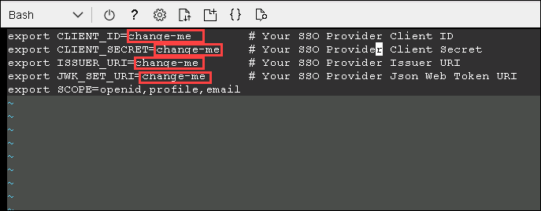
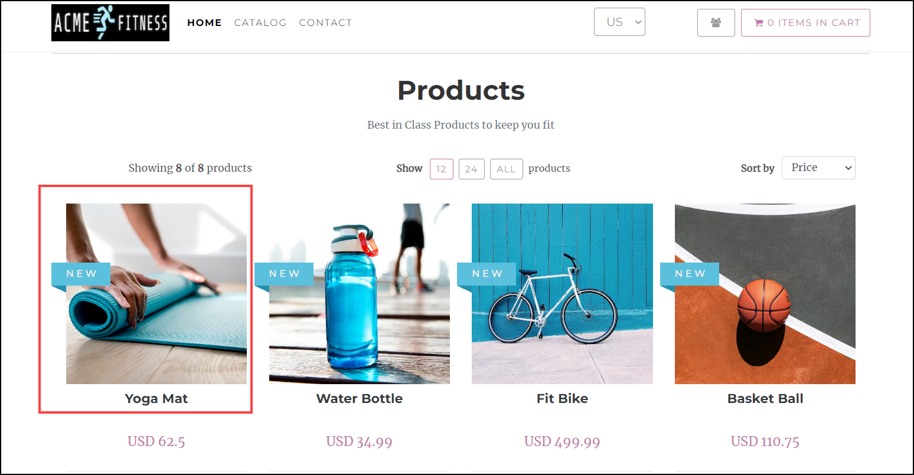
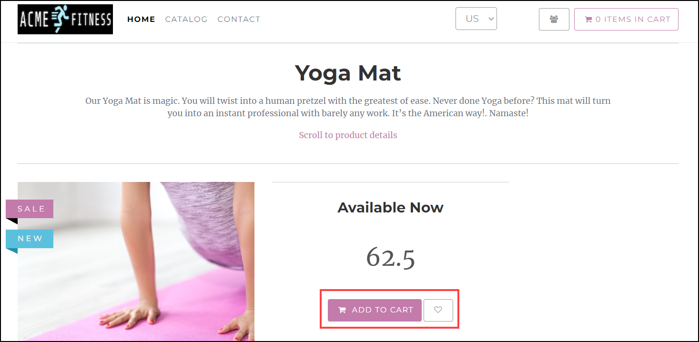
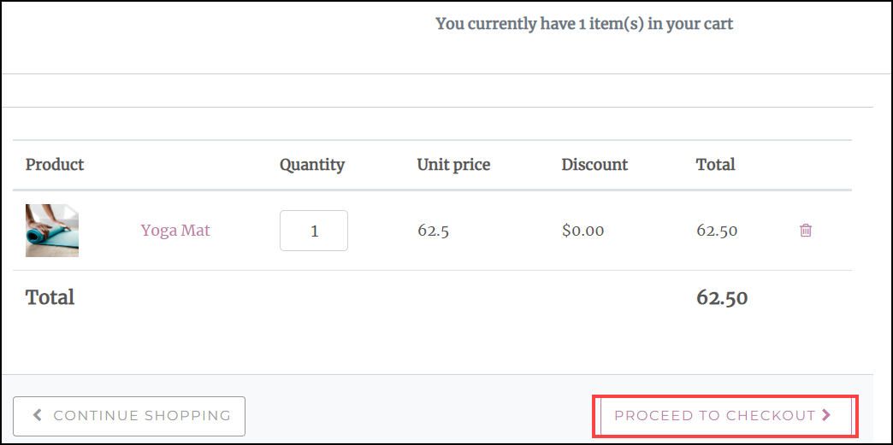
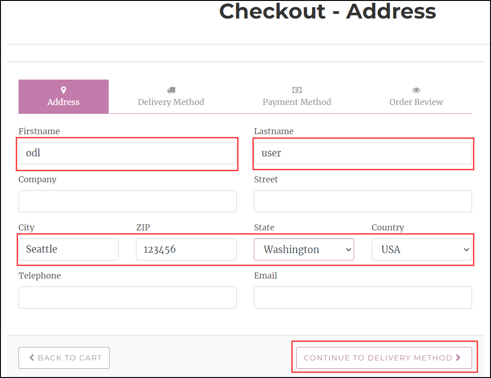
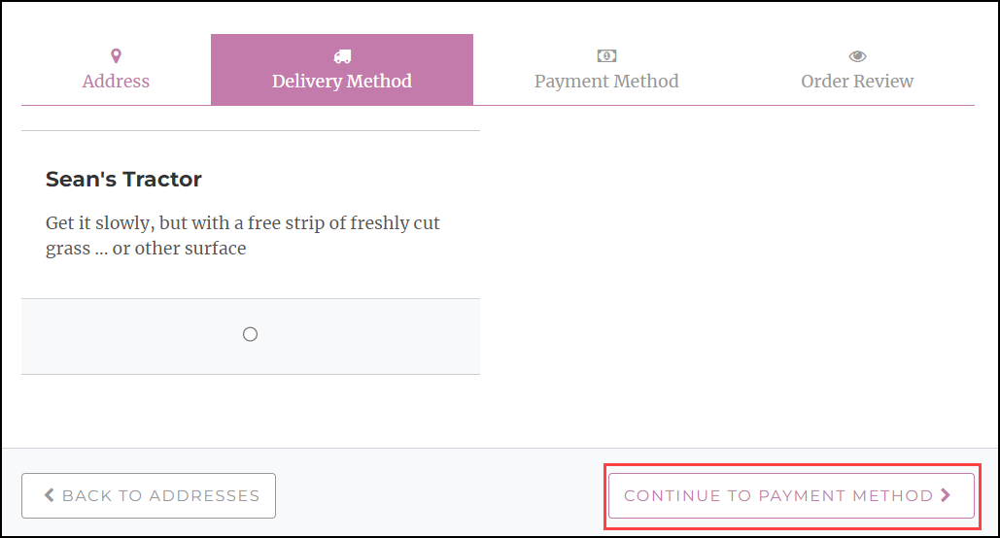
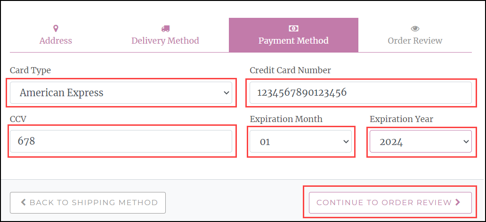
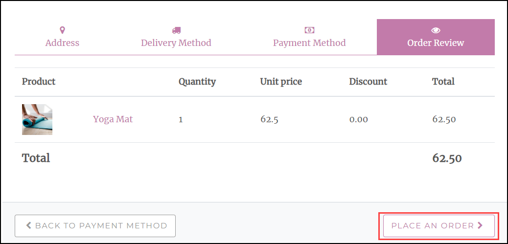
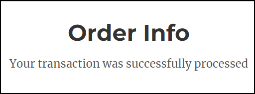
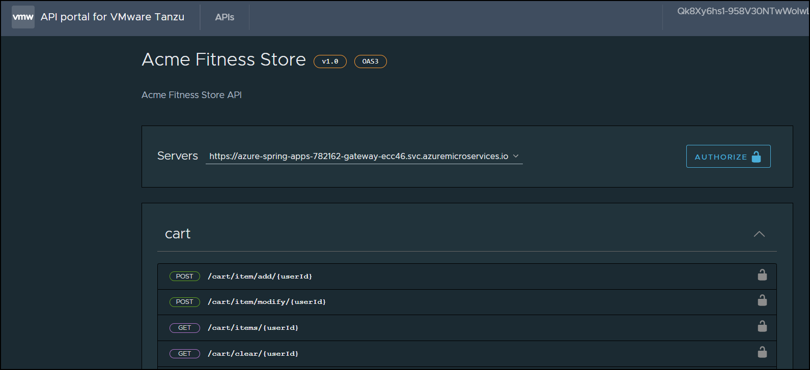

## Lab 2: Configure Single Sign-On
 
In this lab, you will configure Single Sign-On for Spring Cloud Gateway using Azure Active Directory.

### Task 1: Prepare your environment for SSO Deployments

1. To open the `./scripts/setup-sso-variables.template.sh` file, run the following command :

   ```shell
   cd azure
   vim setup-sso-variables-template.sh
   ```
1. Update the following variables in the setup-env-variables.template.sh file by replacing the following values :

   ```shell
   export CLIENT_ID=change-me            # Your SSO provider Client ID
   export CLIENT_SECRET=change-me        # Your SSO provider Client Secret
   export ISSUER_URI=change-me           # Your SSO provider Issuer URI
   export JWK_SET_URI=change-me          # Your SSO provider Json Web Token URI
   ```
   
   >**Note:** You can copy the above values from environment details page.


   

1. Run the following command to set the environment and then verify the environment variables are set:

   ```shell
   cd ..
   source ./azure/setup-sso-variables-ad.sh

   echo ${CLIENT_ID}
   echo ${CLIENT_SECRET}
   echo ${TENANT_ID}
   echo ${ISSUER_URI}
   echo ${JWK_SET_URI}
   ```
    > **Note:** Copy the output values and save them in the notepad as these will be used later in the lab. ( The ISSUER_URI should take the form https://login.microsoftonline.com/${TENANT_ID}/v2.0 The JWK_SET_URI should take the form https://login.microsoftonline.com/${TENANT_ID}/discovery/v2.0/keys)

1. To add the necessary web redirect URIs to the Azure AD Application Registration, run the following command:

   ```shell
   az ad app update --id ${APPLICATION_ID} \
    --web-redirect-uris "https://${GATEWAY_URL}/login/oauth2/code/sso" "https://${PORTAL_URL}/oauth2-redirect.html" "https://${PORTAL_URL}/login/oauth2/code/sso"
   ```

 
### Task 2: Configure Spring Cloud Gateway with SSO  

1. Run the following command to configure Spring Cloud Gateway with SSO enabled:

   ```shell
   az spring gateway update \
       --client-id ${CLIENT_ID} \
       --client-secret ${CLIENT_SECRET} \
       --scope ${SCOPE} \
       --issuer-uri ${ISSUER_URI} \
       --no-wait
   ```   

   

### Task 3: Update the Existing Applications 

1. Run the following command to update the existing applications to use authorization information from Spring Cloud Gateway:

   ```shell
   # Update the Cart Service
   az spring app update --name ${CART_SERVICE_APP} \
       --env "AUTH_URL=https://${GATEWAY_URL}" "CART_PORT=8080" 
    
   # Update the Order Service
   az spring app  update --name ${ORDER_SERVICE_APP} \
       --env "AcmeServiceSettings__AuthUrl=https://${GATEWAY_URL}" 
   ```
   


### Task 4: Login to the Application through Spring Cloud Gateway 

1. Run the following command to retrieve the URL for Spring Cloud Gateway and then open the output in a browser:

   ```shell
   echo "https://${GATEWAY_URL}"
   ```
   
 
2. You should see the ACME Fitness Store Application, and then click on **Login** button.
   
   
   
3. Click on **Accept** inorder to able to log in using your SSO Credentials. 

   
   
4. Once logged in, the remaining functionality of the application will be available. Click on **Catalog** to see the list of products.

   
   
5. Click on **Yoga Mat** to add this item in your cart.  
   
   

6. Under Yoga Mat, click on Add to cart.
   
    

7. Now click on **1 items in cart** to proceed futher to place an order.   
   
   
   
8. To place an order, click on **Proceed to checkout**.
   
   
   
9. On the Address pane of the checkout page, fill the following details and then click on **Continue to Delivery Method**:

  - Firstname: odl

  - Lastname: user
  
  - City: Seattle
  
  - ZIP: 123456
  
  - State: Washington
  
  - Country: USA
  
  - Leave the other values as blank  
  
   
     
   
 
10. On the Delivery Method pane, click on **Continue to Payment Method**.   
   
     
   
11. On the Payment Method pane, fill the following details and then click on **Continue to Order Review**.

  - Card Type: American Express
  
  - Credit Card Number: 1234567890123456
  
  - CCV: 678
  
  - Expiration Month: 01
  
  - Expiration Year: 2024    
   
     <br>
     <br>
   
     
    
   
12. On the Order Review pane, click on **Place an Order**.   
   
     
   
13. After that you will recieve a pop-up page for Successfully placing an order.
  
      <br>
      <br>
      <br>
      <br>
  
     

### Task 5: Configure SSO for API Portal 

1. To configure API Portal with SSO enabled, run the following command:

   ```shell
   export PORTAL_URL=$(az spring api-portal show | jq -r '.properties.url')

   az spring api-portal update \
       --client-id ${CLIENT_ID} \
       --client-secret ${CLIENT_SECRET}\
       --scope "openid,profile,email" \
       --issuer-uri ${ISSUER_URI}
   ```

    

### Task 6: Explore the API using API Portal 

1. Run the following command to retrieve the URL for API Portal and then open the output in a browser: 

   ```shell
   echo "https://${PORTAL_URL}"
   ```

    

1. To access the API Portal, click on **Sign in via SSO**. 

    
   
1. Once logged in via SSO credentials, you can now explore the API portal.
   
    
    
    
   Now, click on **Next** in the lab guide section in the bottom right corner to jump to the next exercise instructions.
