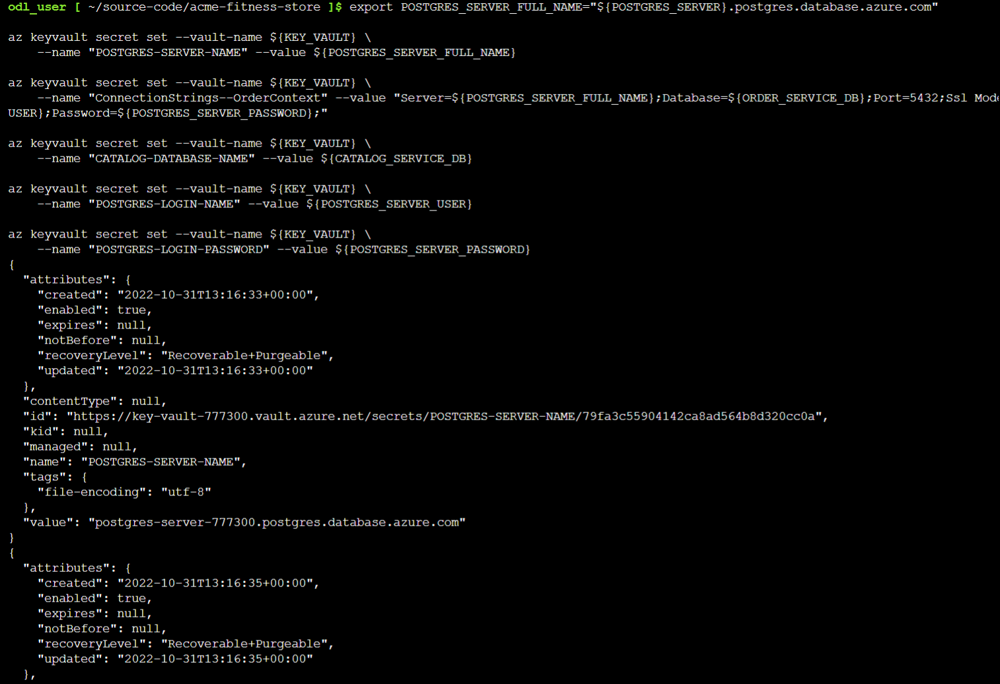
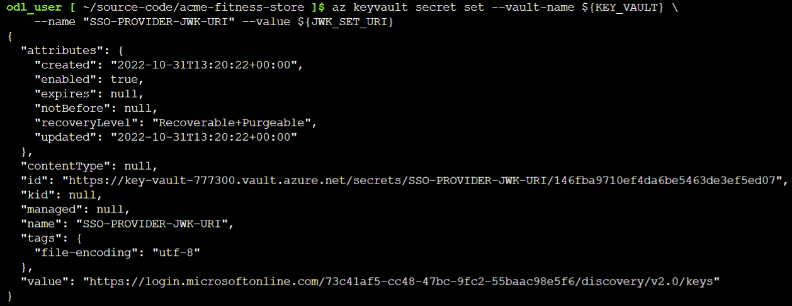
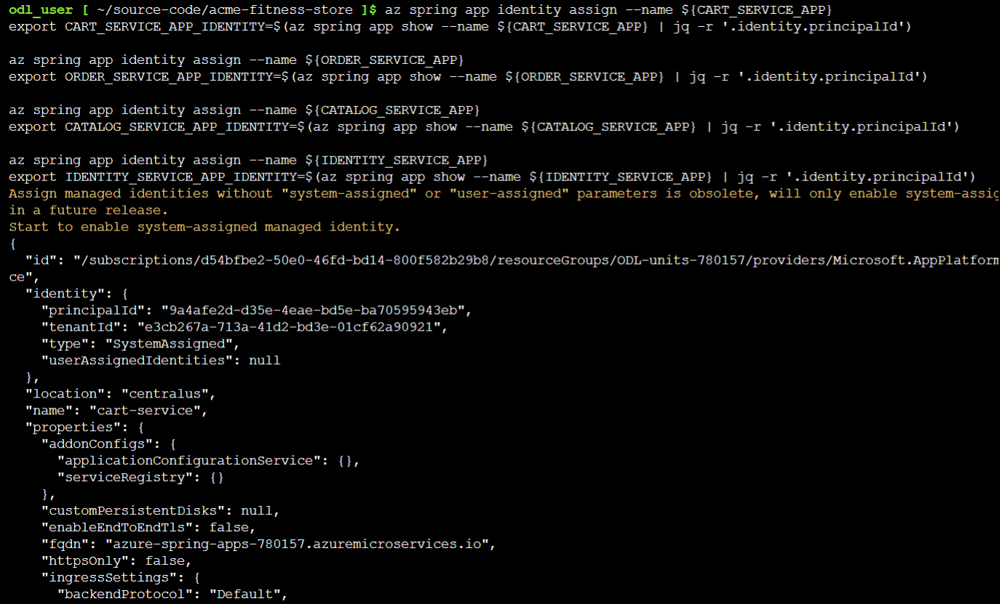
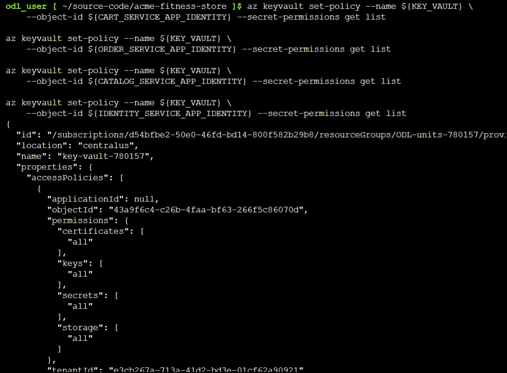
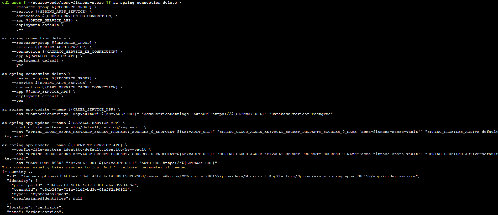

## Lab 4: Load Application Secrets using Key Vault

Duration: 15 minutes

In this lab, you will use Azure Key Vault to securely store and load secrets to connect to Azure services. The **Microsoft Azure Key Vault** service focuses on the security of the below subjects:

 - **Secret Management**: The Azure Key Vault service can be used to securely store and control access of secrets, such as authentication keys, storage account keys, passwords, tokens, API keys, .pfx files, and other secrets.
 
 - **Key Management**: The Azure Key Vault service can be used to manage the encryption keys for data encryption.

 - **Certificate Management**: The Azure Key Vault service enables you to provision, manage, and deploy SSL/TLS certificates seamlessly for use with Azure integrated services.

**Azure Key Vault** allows users to securely manage application keys and secrets by enforcing role-based access policies. Applications have no direct access to keys, this ensures that secrets are not passed on to a person who has no permissions to the respective resources.

### Task 1: Store secrets

1. Choose a unique name for your Key Vault and set an environment variable with the value **<inject key="keyvault + DeploymentID" enableCopy="true" />** (Replace "change-me" with the mentioned key vault name.)
    
     ```shell
     export KEY_VAULT="change-me"      # customize this
     ```
1. Run the following command to store connection secrets:

    ```shell
    export KEYVAULT_URI=$(az keyvault show --name ${KEY_VAULT} | jq -r '.properties.vaultUri')
    ```
   
1.  To store database connection secrets in Key Vault, run the following command:

      ```shell
      export POSTGRES_SERVER_FULL_NAME="${POSTGRES_SERVER}.postgres.database.azure.com"

      az keyvault secret set --vault-name ${KEY_VAULT} \
         --name "POSTGRES-SERVER-NAME" --value ${POSTGRES_SERVER_FULL_NAME}

      az keyvault secret set --vault-name ${KEY_VAULT} \
         --name "ConnectionStrings--OrderContext" --value "Server=${POSTGRES_SERVER_FULL_NAME};Database=${ORDER_SERVICE_DB};Port=5432;Ssl Mode=Require;User          Id=${POSTGRES_SERVER_USER};Password=${POSTGRES_SERVER_PASSWORD};"
    
      az keyvault secret set --vault-name ${KEY_VAULT} \
         --name "CATALOG-DATABASE-NAME" --value ${CATALOG_SERVICE_DB}
    
      az keyvault secret set --vault-name ${KEY_VAULT} \
         --name "POSTGRES-LOGIN-NAME" --value ${POSTGRES_SERVER_USER}
    
      az keyvault secret set --vault-name ${KEY_VAULT} \
         --name "POSTGRES-LOGIN-PASSWORD" --value ${POSTGRES_SERVER_PASSWORD}
      ```
      
      

1. To retrieve and store Redis connection secrets in Key Vault, run the following command:

      ```shell
      az redis show -n ${AZURE_CACHE_NAME} > redis.json
      export REDIS_HOST=$(cat redis.json | jq -r '.hostName')
      export REDIS_PORT=$(cat redis.json | jq -r '.sslPort')

      export REDIS_PRIMARY_KEY=$(az redis list-keys -n ${AZURE_CACHE_NAME} | jq -r '.primaryKey')

      az keyvault secret set --vault-name ${KEY_VAULT} \
      --name "CART-REDIS-CONNECTION-STRING" --value "rediss://:${REDIS_PRIMARY_KEY}@${REDIS_HOST}:${REDIS_PORT}/0"
      ```

      

1. Run the following command to store SSO secrets in the Key Vault:

      ```shell
      az keyvault secret set --vault-name ${KEY_VAULT} \
         --name "SSO-PROVIDER-JWK-URI" --value ${JWK_SET_URI}
      ```

      

1. Run the following command to enable System-Assigned Identities for applications and export identities to the environment:

      ```shell
      az spring app identity assign --name ${CART_SERVICE_APP}
      export CART_SERVICE_APP_IDENTITY=$(az spring app show --name ${CART_SERVICE_APP} | jq -r '.identity.principalId')

      az spring app identity assign --name ${ORDER_SERVICE_APP}
      export ORDER_SERVICE_APP_IDENTITY=$(az spring app show --name ${ORDER_SERVICE_APP} | jq -r '.identity.principalId')

      az spring app identity assign --name ${CATALOG_SERVICE_APP}
      export CATALOG_SERVICE_APP_IDENTITY=$(az spring app show --name ${CATALOG_SERVICE_APP} | jq -r '.identity.principalId')

      az spring app identity assign --name ${IDENTITY_SERVICE_APP}
      export IDENTITY_SERVICE_APP_IDENTITY=$(az spring app show --name ${IDENTITY_SERVICE_APP} | jq -r '.identity.principalId')
      ```

     > **Note:** Please note that the above commands can run for up to 5 minutes. 

      

1.  Run the following command to add an access policy to Azure Key Vault to allow Managed Identities to read secrets:

      ```shell
      az keyvault set-policy --name ${KEY_VAULT} \
         --object-id ${CART_SERVICE_APP_IDENTITY} --secret-permissions get list
    
      az keyvault set-policy --name ${KEY_VAULT} \
         --object-id ${ORDER_SERVICE_APP_IDENTITY} --secret-permissions get list

      az keyvault set-policy --name ${KEY_VAULT} \
         --object-id ${CATALOG_SERVICE_APP_IDENTITY} --secret-permissions get list

      az keyvault set-policy --name ${KEY_VAULT} \
         --object-id ${IDENTITY_SERVICE_APP_IDENTITY} --secret-permissions get list
      ```

       

### Task 2: Activate applications to load secrets from Azure Key Vault


1. To delete Service Connectors and activate applications to load secrets from Azure Key Vault, run the following command in the git bash:

      ```shell
      az spring connection delete \
          --resource-group ${RESOURCE_GROUP} \
         --service ${SPRING_APPS_SERVICE} \
         --connection ${ORDER_SERVICE_DB_CONNECTION} \
         --app ${ORDER_SERVICE_APP} \
         --deployment default \
         --yes 

      az spring connection delete \
         --resource-group ${RESOURCE_GROUP} \
         --service ${SPRING_APPS_SERVICE} \
         --connection ${CATALOG_SERVICE_DB_CONNECTION} \
         --app ${CATALOG_SERVICE_APP} \
         --deployment default \
         --yes 

      az spring connection delete \
         --resource-group ${RESOURCE_GROUP} \
         --service ${SPRING_APPS_SERVICE} \
         --connection ${CART_SERVICE_CACHE_CONNECTION} \
         --app ${CART_SERVICE_APP} \
         --deployment default \
         --yes 
    
      az spring app update --name ${ORDER_SERVICE_APP} \
         --env "ConnectionStrings__KeyVaultUri=${KEYVAULT_URI}" "AcmeServiceSettings__AuthUrl=https://${GATEWAY_URL}" "DatabaseProvider=Postgres"

      az spring app update --name ${CATALOG_SERVICE_APP} \
         --config-file-pattern catalog/default,catalog/key-vault \
         --env "SPRING_CLOUD_AZURE_KEYVAULT_SECRET_PROPERTY_SOURCES_0_ENDPOINT=${KEYVAULT_URI}"             "SPRING_CLOUD_AZURE_KEYVAULT_SECRET_PROPERTY_SOURCES_0_NAME='acme-fitness-store-vault'" "SPRING_PROFILES_ACTIVE=default,key-vault"
    
      az spring app update --name ${IDENTITY_SERVICE_APP} \
         --config-file-pattern identity/default,identity/key-vault \
         --env "SPRING_CLOUD_AZURE_KEYVAULT_SECRET_PROPERTY_SOURCES_0_ENDPOINT=${KEYVAULT_URI}"       "SPRING_CLOUD_AZURE_KEYVAULT_SECRET_PROPERTY_SOURCES_0_NAME='acme-fitness-store-vault'" "SPRING_PROFILES_ACTIVE=default,key-vault"
    
      az spring app update --name ${CART_SERVICE_APP} \
         --env "CART_PORT=8080" "KEYVAULT_URI=${KEYVAULT_URI}" "AUTH_URL=https://${GATEWAY_URL}"
      ```

      
    
    
    > **Note:** The above commands to delete service connectors and activate applications will take up to **8** minutes. Wait until the command run is successful.
    
    > **Note:** After finishing the exercise, be sure not to close the Git Bash window.
    
  Now, click on **Next** in the lab guide section in the bottom right corner to jump to the next exercise instructions.
