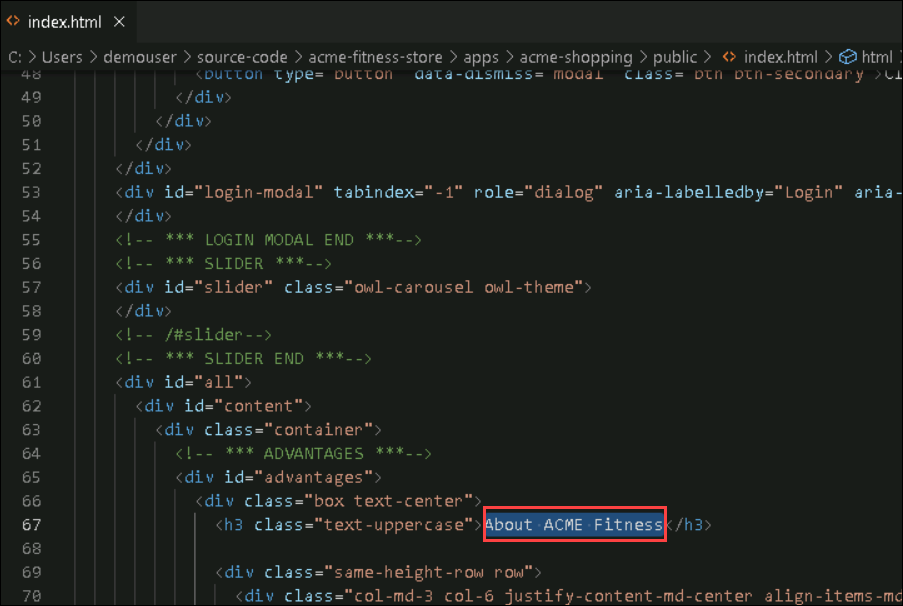
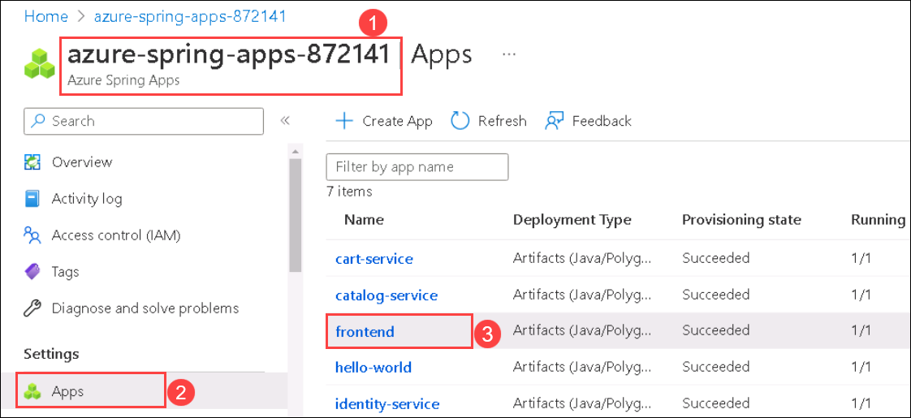
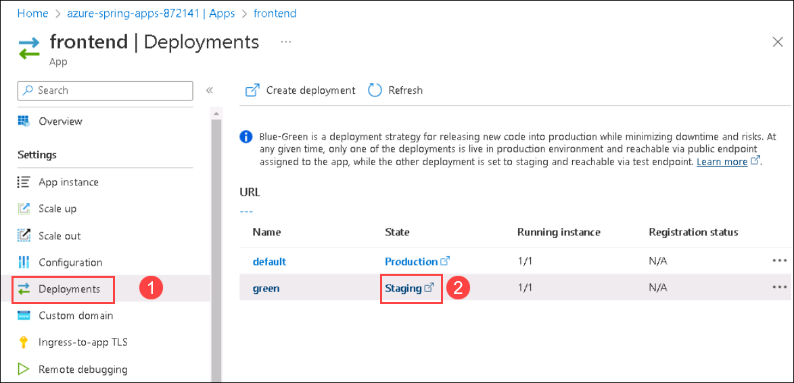

## Lab 6: Change the Application Code and Update the App (Optional)

Duration: 10 minutes

  In this exercise, you will be updating the source code of the application and the spring application.
  
1. Navigate back to the Git Bash window and run the below command to open the index file where you will be making the code changes. 

   ```bash
   
   code ~/source-code/acme-fitness-store/apps/acme-shopping/public/index.html
   cd ~/source-code/acme-fitness-store
   ```

1. The index.html file will open with VS Code Editor, now in line number **67**, update the value from **About ACME Fitness** to **ACME Fitness key Points** and save the file using **Ctrl+S** key.

     

     

1. Once the changes are done, you will be publishing a new staging deployment to the frontend application.

1. Run the below command in the Git Bash to create a new deployment named as **staging-update** for the frontend application.

    ```bash
    az spring app deployment create --name green --app ${FRONTEND_APP} --source-path ./apps/acme-shopping 
    ```
  
    > **Note:** Please note that the above command can run for up to 10 minutes. Wait until it runs successfully.

  
1. Once the creation of the new deployment is completed, navigate back to Azure Spring Apps named **<inject key="Spring App Name" enableCopy="true" />** **(1)** in Azure Portal. Then click on **Apps** **(2)** from the left menu under Settings and select **frontend** **(3)** app from the list.

    
    
1. In **frontend** App pane, click on **Deployments** **(1)** from the left menu under Settings and click on the **Staging** **(2)** hyperlink next to **green** deployment to verify the new staging deployment to the frontend application
    
    
    
    
    
1. Now, we will be moving the **green** deployment to the production to see the changes from the production URL.

1. To set up the deployment to production, move back to the Git Bash window and run the below command:

    ```bash
    az spring app set-deployment --deployment green --name ${FRONTEND_APP}
    ```
    
    
    
1. Once the set deployment is completed, refresh the main application Gateway URL, and you should be able to see the changes in production. If you do not have the application open, run the below command to get the Gateway endpoint. (Copy the URL and paste it in a new browser.)

    ```bash
    echo "https://${GATEWAY_URL}"
    ```
     
    
Now, click on **Next** in the lab guide section in the bottom right corner to jump to the next exercise instructions.
