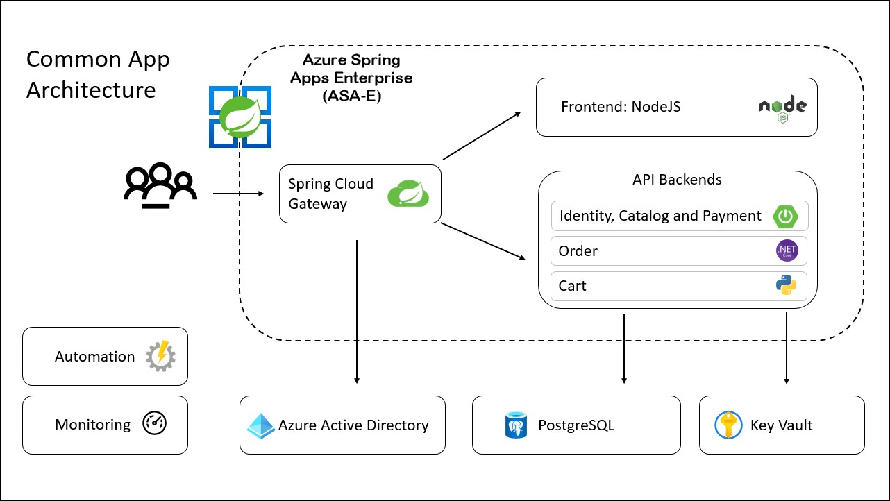

## Overview

The Acme-fitness application is an online shopping platform for having the best equipment to make you fit. This sample application comprises a variety of services, such as:

* Three Java Spring Boot applications:
  * A catalog service for fetching available products.
  * A payment service for processing and approving payments for users' orders.
  * An identity service for referencing the authenticated user.

* 1 Python application:
  * A cart service for managing a users' items that have been selected for purchase.

* 1 ASP.NET Core applications:
  * An order service for placing orders to buy products that are in the users' carts.

* 1 NodeJS and static HTML Application:
  * A frontend shopping application.

## Hands-on Labs Scenario
In this hands-on lab, you will deploy existing demo application i.e. ACME FITNESS Store application written in Java, Python, and C# to Azure using Azure Spring Apps Enterprise (ASA-E). You can simply execute Spring Boot and polyglot applications on Azure with ASA-E. After you're done, you can either switch to Azure Portal or continue managing the application using the Azure CLI.

## Lab Context
Throughout this hands-on lab, you will learn several things:

- Build and deploy both frontend and backend Spring applications to Azure Spring Apps.
- Configure Single Sign-On (SSO) for the application using Azure Active Directory.
- Create persistent stores (PostgreSQL and Azure Cache for Redis) outside the applications and connect those applications to those stores.
- Use Azure Key Vault to securely store and load secrets to connect to Azure services.
- Monitor applications using Application Insights and Log Analytic Workspace.
- Updating the source code of the application and the spring application.
- Use Spring Cloud Gateway filters to apply rate limiting to your API.
- Automate provisioning and deployments using GitHub Actions.

## Architecture

> **Note:** Please be aware that each lab depends on the one before it. In order to complete the lab successfully, you need to ensure that you have not misssed any previous tasks while performing the lab.

| Lab No | Lab Name | Required/Optional | Duration |
| ------ | -------- | ----------------- | -------- |
| Lab 1 | Deploy and Build Applications | Required | 40 Minutes |
| Lab 2 | Configure Single Sign-On | Required | 20 Minutes |
| Lab 3 | Integrate with Azure Database for PostgreSQL and Azure Cache for Redis | Required | 20 Minutes |
| Lab 4 | Load Application Secrets using Key Vault | Required | 15 Minutes |
| Lab 5 | Monitor Applications End-to-End | Optional | 40 Minutes|
| Lab 6 | Change the Application Code and Update the App | Optional | 10 Minutes |
| Lab 7 | Set Request Rate Limits | Optional | 15 Minutes |
| Lab 8 | Automate from Idea to Production | Optional | 15 Minutes |

